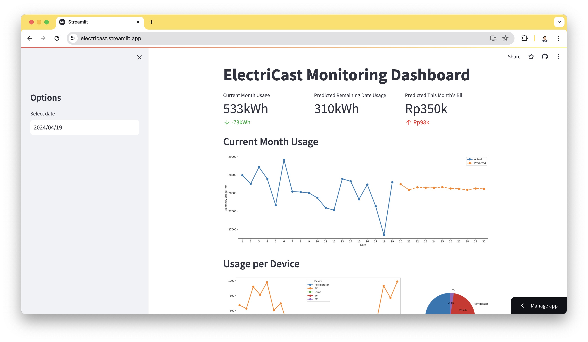

# ElectriCast
Electricast is an innovative application designed to revolutionize how households manage their electricity usage. By integrating seamlessly with Internet of Things (IoT) devices and harnessing the power of artificial intelligence (AI), Electricast provides accurate forecasts of electricity consumption, empowering users to make informed decisions about their energy usage.



## Features
- **IoT Integration**: Electricast seamlessly integrates with IoT devices to gather real-time data on electricity usage within households.
- **AI Forecasting**: Leveraging advanced AI algorithms, Electricast predicts future electricity consumption patterns, enabling users to optimize their energy usage and reduce costs.
- **Insightful Dashboard**: Electricast offers an intuitive dashboard that displays current electricity usage metrics alongside predictive analytics for future usage trends. Users can visualize their energy consumption patterns and make adjustments accordingly.

## Installation
Electricast is live on https://electricast.streamlit.app/ or you can install it on your device, follow these steps:
1. Clone the repository from GitHub:
   ```
   git clone https://github.com/your-username/electricast.git
   ```
2. Navigate to the project directory:
   ```
   cd electricast
   ```
3. Install dependencies:
   ```
   pip install -r requirements
   ```
4. Start the application:
   ```
   streamlit run app.py
   ```

## Usage
Once Electricast is installed and running, users can access the dashboard through their web browser. From the dashboard, users can view real-time electricity usage data, explore predictive analytics, and adjust settings to optimize energy consumption.


## Contact
For any inquiries or support, please contact us at dandyarifrahman.work@gmail.com.
